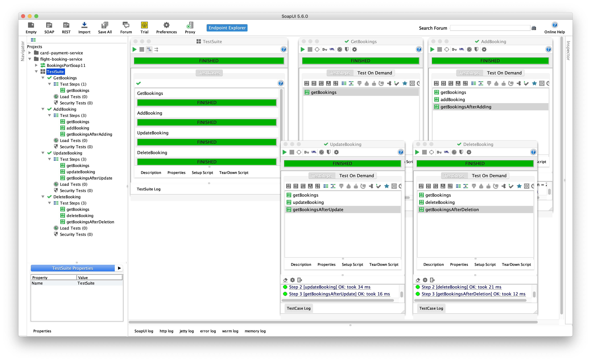
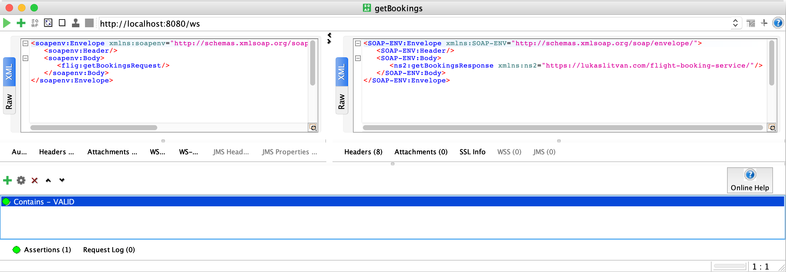
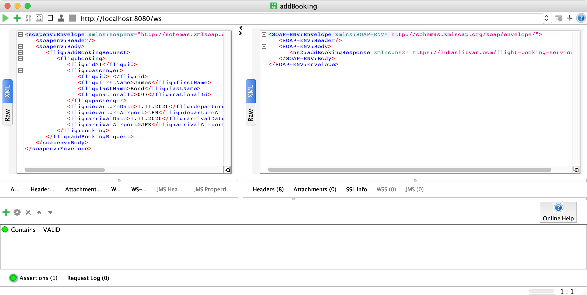
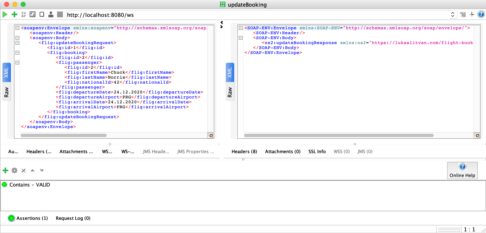
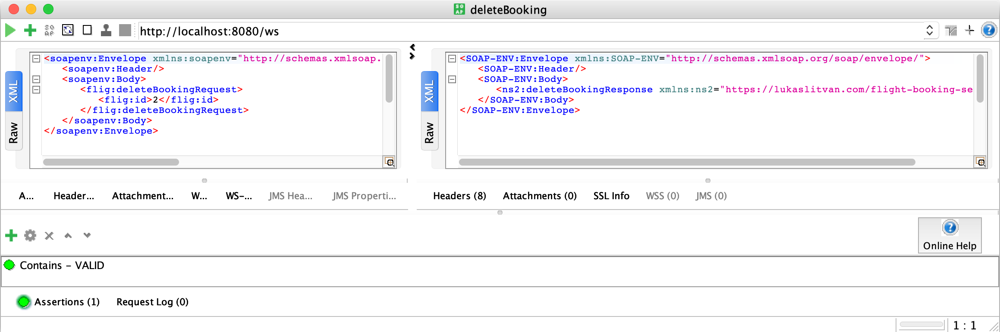

# Flight booking service
Simple SOAP/WSDL Web Service for management of flight bookings written in Java (Spring).

### WSDL
When running locally (port `8080`), the `WSDL` for the service is available at `http://localhost:8080/ws/bookings.wsdl`.

### Supported operations
* Get all bookings
* Add a booking
* Update a booking (specified by id)
* Remove booking (specified by id)

### Testing
4 test cases were created in SoapUI and are covering this basic scenario: Getting all bookings, adding a booking, modifying the added booking and then removing it. The SoapUI project can be found [here](src/flight-booking-service-soapui-project.xml).

### Screenshots of the test cases

