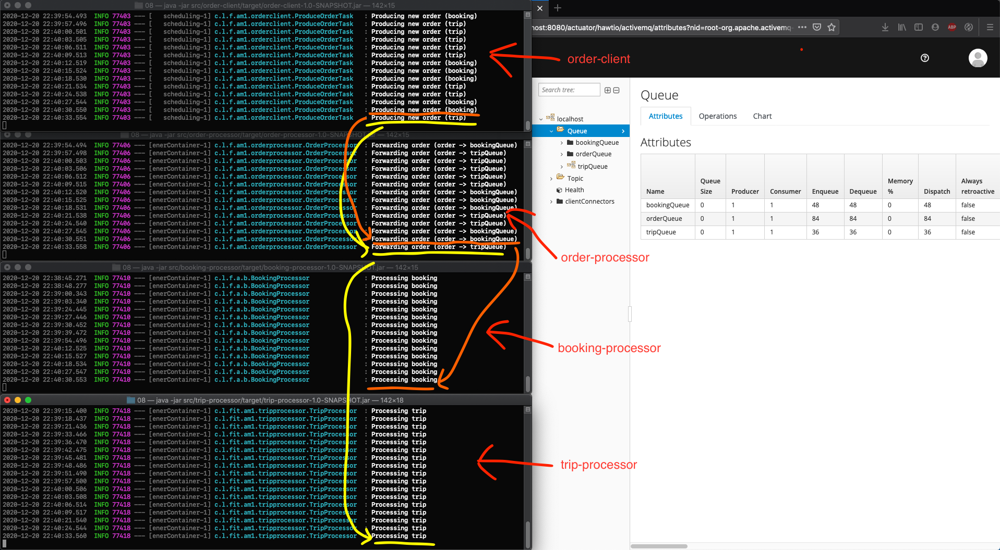

# Order processing (Message Forwarding)

Four simple processes simulating the processing of an order.

## order-client 
Creates and order (every 3 seconds) and puts it into a message queue named `orderQueue`.

## order-processor
Reads incoming orders from `orderQueue` and decides, whether to put it in `bookingQueue` or in `tripQueue` based on the order.

## booking-processor
Processes the booking.

## trip-processor
Processes the trip.

## Screenshot

